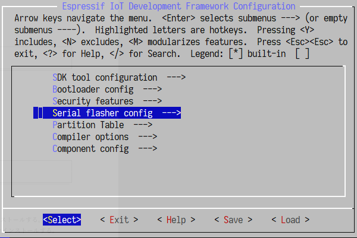

# IKARI-ESP32

# toc

# ESP32開発環境のセットアップ

## 概要

公式サイトのドキュメントを参照。

OS環境全てで適用可能な汎用的なセットアップ方法。

[ESP\-IDF Programming Guide — ESP\-IDF Programming Guide v3\.2\-dev\-141\-ga3c4325 documentation](http://esp-idf.readthedocs.io/en/latest/index.html)

Windows環境での追加のセットアップ方法。

[Standard Setup of Toolchain for Windows — ESP-IDF Programming Guide v3.2-dev-141-ga3c4325 documentation](http://esp-idf.readthedocs.io/en/latest/get-started/windows-setup.html)

上記ドキュメントの内容に従って進める。

## Toolchainのセットアップ

Windows向けToolchainとMSYSをまとめたファイルをespressif.comからダウンロードする。

https://dl.espressif.com/dl/esp32_win32_msys2_environment_and_toolchain-20180110.zip

ダウンロードしたZIPファイルは`c:\`に展開する。`c:\`以下にmsys32ディレクトリが作成される。

### ESP-IDFを入手

ターミナルを起動するため `c:\msys32\mingw32.exe` を起動する。ターミナルが起動したら、ESP32の環境を保存するためのディレクトリを作成して移動する。

```bash
mkdir -p ~/esp
cd ~/esp
```

ESP-IDFを以下のコマンドを実行して入手する。

```bash
git clone --recursive https://github.com/espressif/esp-idf.git
```

もしここでエラーが出るようであれば、フルパスで指定する。

```bash
/c/Program\ Files/Git/bin/git clone --recursive https://github.com/espressif/esp-idf.git
```

### ESP-IDFへのパスを通す

ESP-IDFを利用するために環境変数 `IDF_PATH` を設定する。 `C:/msys32/etc/profile.d/` ディレクトリ以下にユーザープロファイルスクリプトは保存される。それらはMSYS2ウィンドウが起動される度に実行される。

`export_idf_path.sh` という名前で `C:/msys32/etc/profile.d/` ディレクトリに新しいスクリプトファイルを作成する。

ESP-IDFをセットアップしたパスを確認する。恐らく `C:\msys32\home\user-name\esp\esp-idf` のようなフォルダとなる。ターミナルが立ち上がっていれば以下のコマンドで確認できる。

```bash
(cd ~/esp/esp-idf && pwd -W)
```

確認したパスをスクリプトファイルに追加する。以下のような内容にする。このときにバックスラッシュ `\` は、スラッシュ `/` に置換することに注意する。

```bash
export IDF_PATH="c:/home/user-name/esp/esp-idf"
```

設定を反映するためターミナルを再起動する。

### シェルの起動

`c:\msys32\mingw32.exe` を起動する。

### プロジェクトの開始

セットアップが出来たので、espのサンプルhello_worldを使う。

```bash
cd ~/esp
cp -r $IDF_PATH/examples/get-started/hello_world .
```

### ボードと接続

開発ボードと接続する。

### コンフィグ

ターミナルから以下を実行して設定メニューをビルドする。

```bash
cd ~/esp/hello_world
make menuconfig
```

makeが終了すると、以下画面が表示されるので、`Serial flasher config` > `Default serial port` の順で選択。COMポート名を入力。COMポート名はデバイスマネージャーで実際に接続されたESP32のCOMポート名を入力する。

その後、`< Save >` `< Exit >` `< Exit >`の順で選択しメニューを終了する。


## ビルドと書き込み

以下コマンドでバイナリをESP32に書き込みを実行する。

```bash
make flash
```

モニターしながら実行する場合は、以下のコマンド。 =Ctrl+]= で終了。

```bash
make monitor
```

## 参考: 独自にMSYS2をインストールする

下記手順は必要無いが、参考メモ。

ESP-IDFはWindows環境でMSYS2の動作を前提としているため、MSYS2をインストールする。このときESP-IDFは32ビット版のみ対応のため、必ずMSYS2のインストーラは32ビット版をインストールする。

[MSYS2 homepage](https://www.msys2.org/)

c:/msys32/mingw32.exeを起動する。

コンソールを立ち上げたら、以下のコマンドを実行する。

注意: 以下のメッセージが出たら、右上の×でウィンドウを消す。コンソールを立ち上げ直してpacman -Syuを実行。

```
warning: terminate MSYS2 without returning to shell and check for updates again
warning: for example close your terminal window instead of calling exit
```

注意: Enter a selectionには全てdefault=allを選択する。

```
Enter a selection (default=all):
```

上記の注意をふまえて、以下のコマンドを実行する。

```bash
pacman -Syu
pacman -S base-devel msys2-devel ncurses-devel
```

# Raspberry PiからBLEを使いESP32を制御

## PyBluezの導入

### PyBluez

PyBluez

[GitHub - karulis/pybluez: Bluetooth Python extension module](https://github.com/karulis/pybluez)

### 必要なパッケージのインストール

for Python 2.x

```bash
sudo apt-get install bluez libbluetooth-dev python-dev libboost-all-dev
sudo pip install PyBluez pygattlib
```

for Python 3.x

```bash
sudo apt-get install bluez libbluetooth-dev python3-dev python3-pip libboost-all-dev
sudo pip3 install PyBluez pygattlib
```

### 余談: ByBluezのサンプル

以下は実行の必要は無いが、参考メモ。
サンプルはPyBluezのソースコードと一緒に配布されているので、ソースコード一式を入手する。

```bash
$ git clone https://github.com/karulis/pybluez.git
```

落としたソースのexamplesディレクトリ以下がサンプル。


### ESP32のMACアドレスを確認

以下コマンドでESP32のMACアドレスを確認する。

```bash
sudo hcitool lescan --passive
```

`gatttool` を利用して対話形式でESP32を制御。

`sudo gattool -i hci0 -b <MACアドレス> -I` で対話コンソールを起動

`connect` で接続。

`char-write-req 0x002a <LED値>` LED値 0〜255で指定する。

```bash
sudo gatttool -i hci0 -b 24:0A:C4:07:84:3E -I
[24:0A:C4:07:84:3E][LE]> connect
Attempting to connect to 24:0A:C4:07:84:3E
Connection successful
[24:0A:C4:07:84:3E][LE]> char-write-req 0x002a 78
```

`gatttool` を利用して直接制御する場合は以下のようにする。

`sudo gatttool -b 24:0A:C4:07:84:3E --char-write-req -a 0x002a -n ff`

## 参考

- [Raspberry Piでbluezを使ってBLESerialとつなぐ](https://qiita.com/yujimny/items/7e92f240f48550585500)
